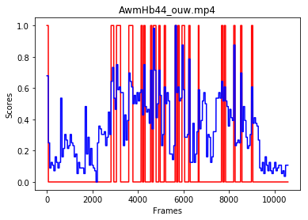

# tvsum

```
from load_tvsum_utils import *  
%pylab inline  
  
video_dic = load_tvsum(data_root_path='./', scale=True)  

for key in video_dic:  
    video_name = key
    fps = video_dic[key]['fps']
    frames = video_dic[key]['frames']
    user_score = video_dic[key]['user_score']
    avg_score = video_dic[key]['avg_score']
    
    summary = get_summary(avg_score, sum_rate=0.15)
    
    len_ = range(0, len(summary))
    plt.plot(len_, summary, 'r', len_, avg_score, 'b')
    plt.title(video_name+'.mp4')
    plt.xlabel("Frames")
    plt.ylabel("Scores")
    plt.savefig("./%s.png"%video)
    plt.show()
    break

```




